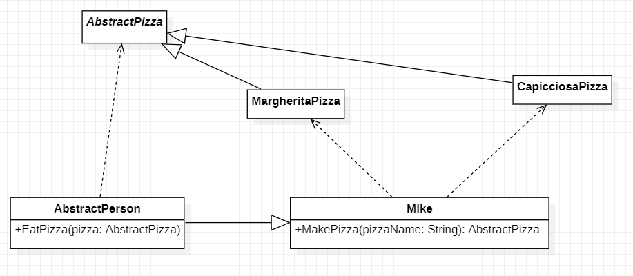
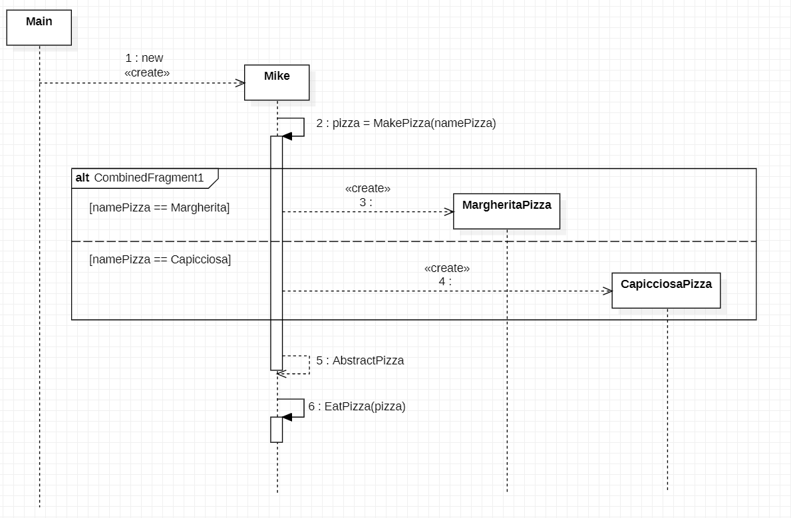
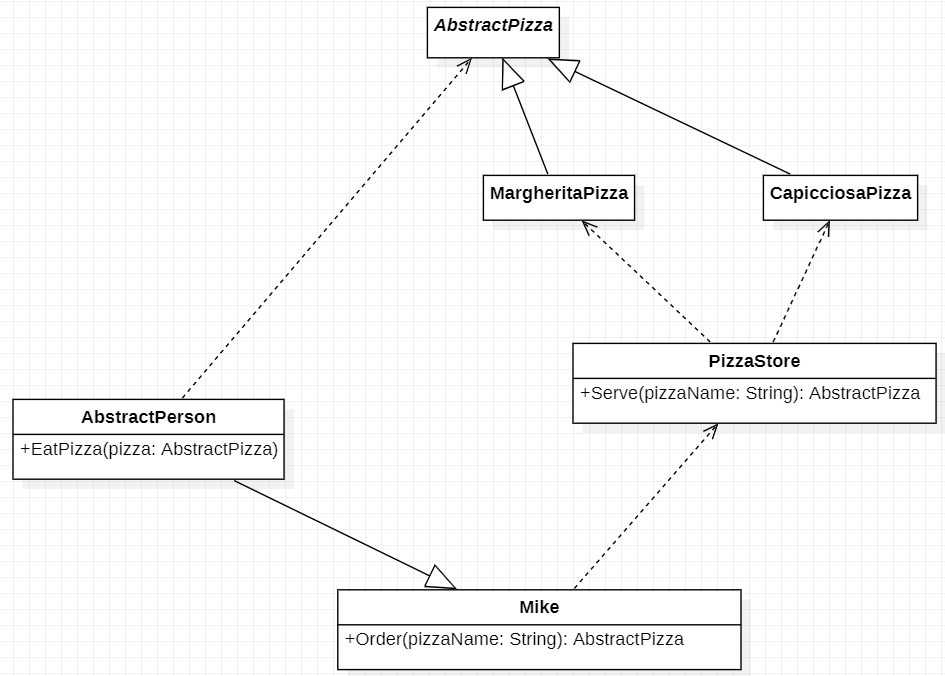
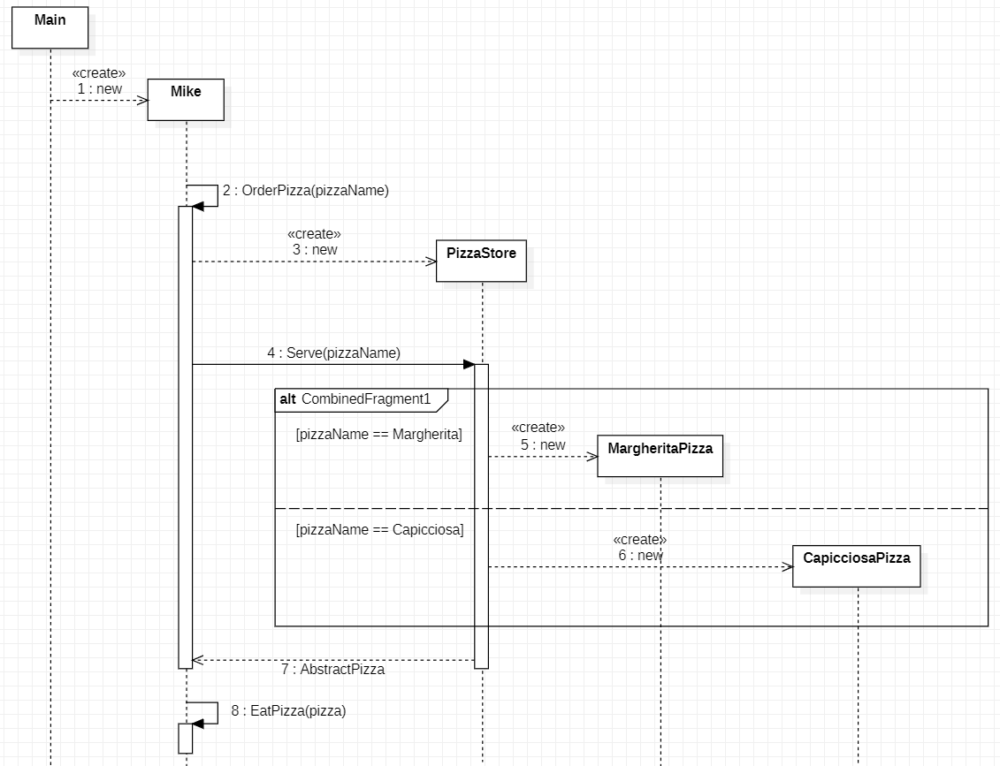
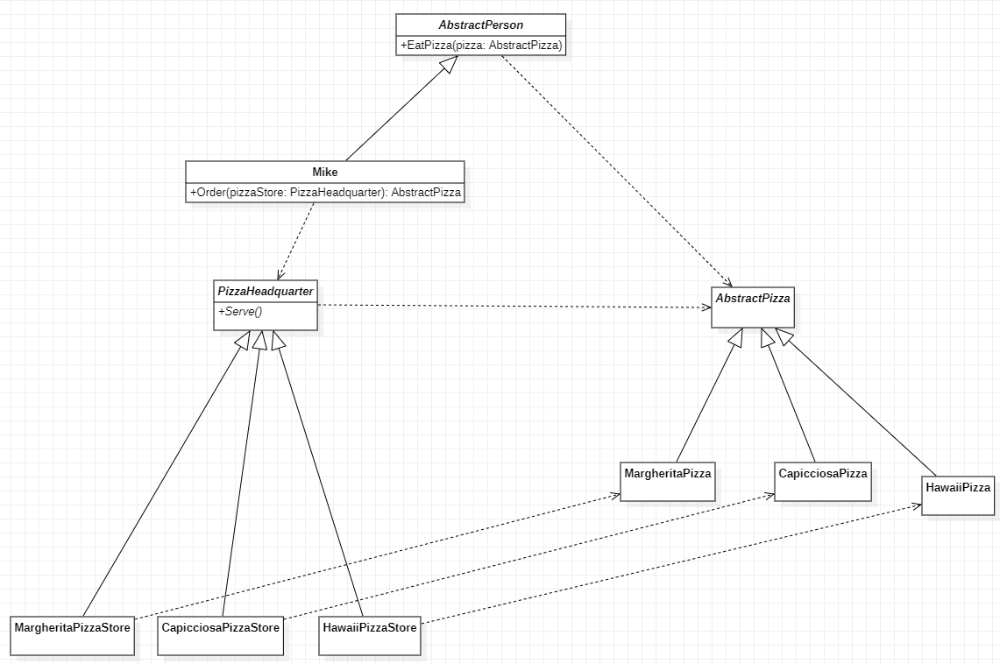
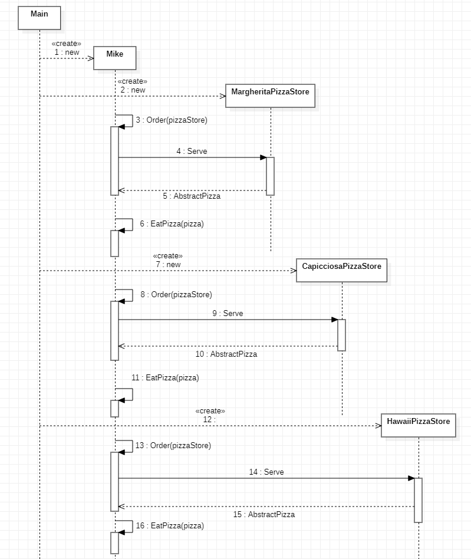
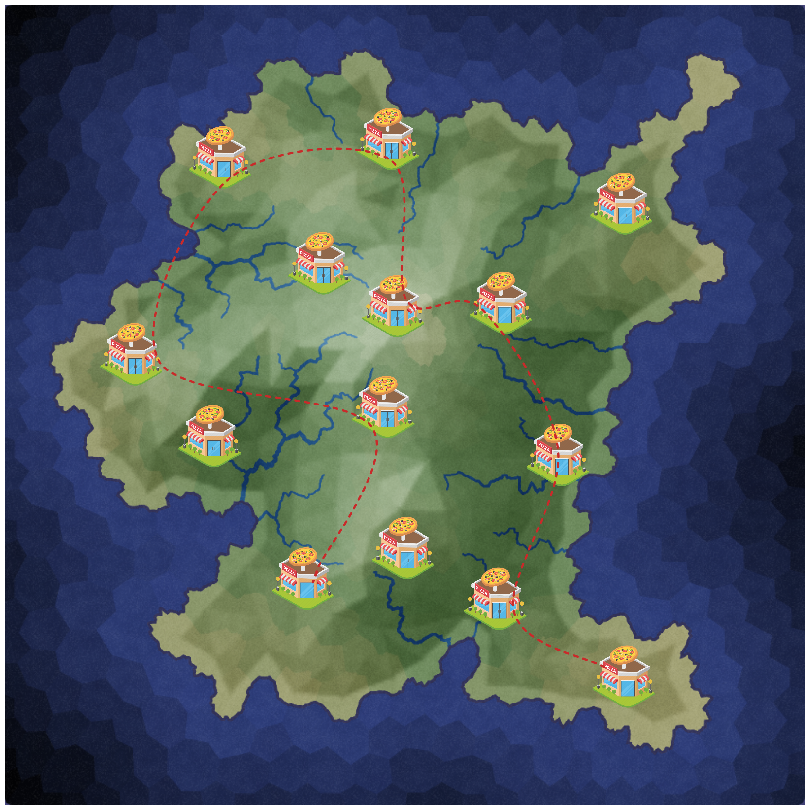
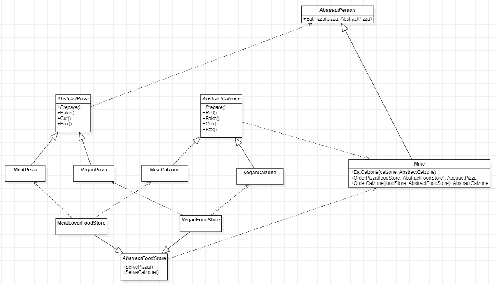
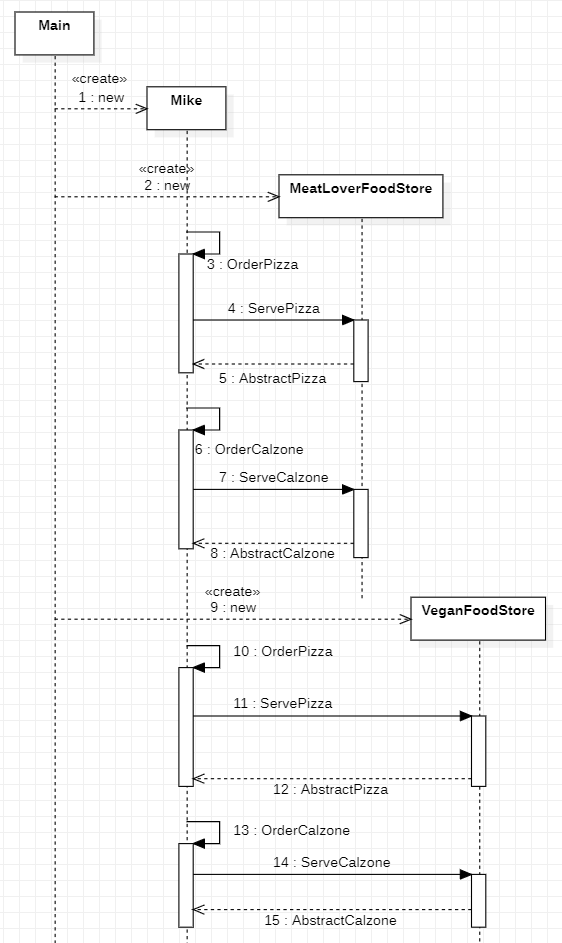

[TOC]

# Factory Pattern

**Creational design patterns** abstract the instantiation process (process of object creation).

They help make a  system independent of how its objects are created, composed, and represented.

Throughout this report, we will use the example of Mike and his favorite food, pizza to demonstrate the one of the creational design patterns, namely, **factory pattern**. We'll see

- how the factory pattern helps Mike get "pizza objects";

- different factory patterns have different characteristics, some of which are convenient for Mike to order pizza, and some are convenient for the pizza store manager to manage the store.

## Mike's homemade pizza - without Factory Pattern

Mike is an absolute pizza lover, he lives in a small town without a single pizza store. So, when people in town want pizza, they make by themselves. Let's see how Mike makes pizza. 

Concrete pizza classes, such as `MargheritaPizza` and `CapicciosaPizza` all inherit from an abstract pizza class, `AbstractPizza`, this is because the process of making different types of pizza is pretty much the same, with minor differences in details.

Mike is one of villagers. Like everyone else, he was born with the skill to eat pizza.



Notice that the concrete class `Mike` has dependencies with the concrete classes `CapicciosaPizza` and `MargheritaPizza` directly, resulting a high coupling.

In contrast, notice that the class `AbstractPerson` has a dependency with the class `AbstractPizza` instead of any concrete class, which follows **Dependence Inversion Principle (DIP)**. DIP states

> High-level modules should not import anything from low-level modules. Both should depend on abstractions.
>
> Abstractions should not depend on details. Details (concrete implementations) should depend on abstractions.

Simply speaking, in a software system, the business logics should depends on the Abstractions, which helps for loosely coupling modules. The classes `AbstractPizza` and `AbstractPerson` are shown below.

```Java
public abstract class AbstractPizza {
    // For the sake of simplicity, there is no attributes or operations in this class.
}

public abstract class AbstractPerson {
    
    // A person can eat pizza, this high-level logic is described by abstractions
    public void EatPizza (AbstractPizza pizza){
    
        System.out.println("I ate a pizza");
    }
}
```

The concrete classes `Mike`, `MargheritaPizza` and `CapicciosaPizza` are also shown below.

```java
public class MargheritaPizza extends AbstractPizza{
    // For the sake of simplicity, there is no attributes or operations in this class.
}

public class CapicciosaPizza extends AbstractPizza {
    // For the sake of simplicity, there is no attributes or operations in this class.
}

public class Mike extends AbstractPerson {
    public AbstractPizza MakePizza (String pizzaName){
        switch (pizzaName){
            // If Mike want to make a Margherita Pizza by myself
            // Mike, need to new the object by himself
            case "Margherita":
                MargheritaPizza margheritaPizza = new MargheritaPizza();
                return margheritaPizza;
            // If Mike want to make a Capicciosa Pizza by myself
            // Mike, need to new the object by himself
            case "Capicciosa":
                CapicciosaPizza capicciosaPizza = new CapicciosaPizza();
                return capicciosaPizza;
            default:
                return null;
        }
    }
}
```

Inheriting the class `AbstractPerson`, Mike also extends a new operation, `MakePizza`. In this operation, Mike creates difference pizza objects according to different types (`pizzaName`).

Abstractly speaking, Mike, as the client, when he wants to implement a simple business logic, "get pizza, and then eat pizza", he also needs to create the pizza object himself. Object creation and business logic are mixed.

```Java
public class Mike extends AbstractPerson {

    public AbstractPizza MakePizza (String pizzaName){
        switch (pizzaName){
            // If Mike want to make a Margherita Pizza by myself
            // Mike, need to new the object by himself
            case "Margherita":
                MargheritaPizza margheritaPizza = new MargheritaPizza();
                return margheritaPizza;
            // If Mike want to make a Capicciosa Pizza by myself
            // Mike, need to new the object by himself
            case "Capicciosa":
                CapicciosaPizza capicciosaPizza = new CapicciosaPizza();
                return capicciosaPizza;
            default:
                return null;
        }
    }
}
```

The `main` program for this example -- Mike's homemade pizza -- is shown below.

```java
public class ApplicationHomemade {
    public static void main(String[] args) {

        // here is a person called mike
        Mike mike = new Mike();

        mike.EatPizza(mike.MakePizza("Margherita"));

    }
}
```

The whole process of this example can be represented by the UML sequence diagram, which is shown below.



1. `main` creates the `Mike` object
2. `Mike` invokes his own operation `MakePizza`, and `namePizza` is passed to specify the type of pizza to make.
3. If `namePizza` is "Margherita", then the operation `MakePizza` will create a `MargheritaPizza` object
4. If `namePizza` is "Capicciosa", then the operation `MakePizza` will create a `CapicciosaPizza` object
5. The operation `MakePizza` return the pizza object.
6. Mike calls his own operation `EatPizza` to eat the returned pizza object.

## Pizza shop is now open - Simple Factory Pattern

Finally someone opened a pizza store in town. Mike and his neighbors don't need to make their pizza by themselves. People now can order pizza from the pizza store.



As shown in the UML class diagram, the class `PizzaStore`, as a server, provides a operation `Serve` which returns a pizza object based on the input `pizzaName`.

```java
public class PizzaStore {
    public AbstractPizza Serve(String pizzaName){
        switch (pizzaName){
            case "Margherita":
                return new MargheritaPizza();
            case "Capicciosa":
                return new CapicciosaPizza();
            default:
                System.out.println("Sorry, no such kind of pizza :(");
                return null;
        }
    }
}
```

As the client, Mike doesn't need to create pizza objects manually. Whenever he wants pizza, he calls his own operation `order` to order pizza simply by telling the pizza store which type of pizza, `pizzaName`,he want.

```java
public class Mike extends AbstractPerson {
    AbstractPizza Order(String pizzaName){
        // If there is a pizza store, Mike doesn't need to make pizza by himself
        // Whenever Mike wants to eat pizza, he just calls the pizza store
        // and tell them what kind of pizza he wants, then they will give him pizza

        PizzaStore pizzaStore = new PizzaStore();
        return pizzaStore.Serve(pizzaName);
    }
}
```

Notice that in the UML class diagram, the concrete class `PizzaStore` has a direct dependency on the concrete classes `MargheritaPizza` and `CapicciosaPizza`, resulting a high coupling. 

Similarly, `Mike` also deeply depends on the concrete class `PizzaStore`, which also leads to high coupling. 

The side effects of coupling will be revealed when the pizza store does expansion. For example, when the pizza shop decides to add a new flavor, maybe Hawaiian pizza, the logic in the operation `serve` needs to change, which violates the **Open–closed Principle**. The open-closed principle states

>Software entities (classes, modules, functions, etc.) should be open for extension, but closed for modification.

Simply speaking, when we want to make changes to the old code, we should write some new code as an extension but not change the old code.

The `main` program for this example -- Pizza shop is now open -- is shown below.

```java
public class ApplicationSimpleFactory {
    public static void main(String[] args) {

        // Here is Mike
        Mike mike = new Mike();
        // He ordered a pizza and then eat it
        mike.EatPizza(mike.Order("Margherita"));

    }
}
```

The whole process of this example can be represented by the UML sequence diagram, which is shown below.



1. `main` creates the `Mike` object.
2. `Mike` calls his `OrderPizza` operation and pass `pizzaName` (tell which type of pizza he wants)
3. The operation `OrderPizza` operation create a `PizzaStore` object
4. The operation `OrderPizza` invokes the operation `Serve` of `PizzaStore` and passes the `pizzaName`
5. If `namePizza` is "Margherita", then the operation `Serve` will create a `MargheritaPizza` object
6. If `namePizza` is "Capicciosa", then the operation `Serve` will create a `CapicciosaPizza` object
7. The operation `Serve` returns the pizza object to `Mike`
8. `Mike` calls `EatPizza` to eat pizza

## The expansion of pizza store - Factory Method Pattern

As the only pizza store in town, the pizza store is very popular. The owner is very happy and ready to expand the store. But it also comes with trouble: <u>Introducing too many types of pizza can cause a lot of troubles in the kitchen. The chef sometimes gets confused because there are so many types of pizza.</u>

The pizza shop owner has an idea, and that is to open branches. Each branch only serves one type of pizza. This can relax the pizza shop owner a lot because he can just sit in his pizza office in the headquarter and only be responsible for training employees and teaching them how to serve pizza.

This logic is indicated in the UML class diagram shown below. Three branches, `MargheritaPizzaStore`,`CapicciosaPizzaStore` and `HawaiiPizzaStore` ,learn how to `serve` pizza from the `PizzaHeadquarter`.



Notice that, in the UML class diagram, the concrete person class, `Mike`, doesn't have a direct dependency on the concrete pizza store classes, namely, `MargheritaPizzaStore`, `CapicciosaPizzaStore` and `HawaiiPizzaStore`. This results a loosely coupling.

Specifically, when `Mike` walks into a pizza store, he can just `order` without any worry because all store have the same behavior to `serve`, which is clear in the UML sequence diagram.

The code for `PizzaHeadquarter` and `Mike` are shown below.

```java
public abstract class PizzaHeadquarter {
    public abstract AbstractPizza Serve();

}

public class Mike extends AbstractPerson {
    AbstractPizza Order(PizzaHeadquarter pizzaStore){
        return pizzaStore.Serve();
    }
}
```

The code for the new flavor pizza, `HawaiiPizza`, and its corresponding `HawaiiPizzaStore` are shown below.

```java
public class HawaiiPizza extends AbstractPizza{
}

public class HawaiiPizzaStore extends PizzaHeadquarter{
    @Override
    public AbstractPizza Serve() {
        return new HawaiiPizza();
    }
}
public class MargheritaPizzaStore extends PizzaHeadquarter{
    @Override
    public AbstractPizza Serve() {
        return new MargheritaPizza();
    }
}
public class CapicciosaPizzaStore extends PizzaHeadquarter{
    @Override
    public AbstractPizza Serve() {
        return new CapicciosaPizza();
    }
}
```

The `main` program for this example -- The expansion of pizza store -- is shown below.

```java
public class ApplicationFactoryMethod {
    public static void main(String[] args) {

        // Here is Mike
        Mike mike = new Mike();


        // If there is a Margherita Pizza store in his town
        MargheritaPizzaStore margheritaPizzaStore = new MargheritaPizzaStore();
        // Whenever he wants Margherita Pizza, he can order
        mike.EatPizza(mike.Order(margheritaPizzaStore));

        // If there is a Capicciosa Pizza store in his town
        CapicciosaPizzaStore capicciosaPizzaStore = new CapicciosaPizzaStore();
        // Whenever he wants Capicciosa Pizza, he can order
        mike.EatPizza(mike.Order(capicciosaPizzaStore));

        // Now, if there is a new Hawaii pizza store
        HawaiiPizzaStore hawaiiPizzaStore = new HawaiiPizzaStore();
        // Whenever he want Hawaii Pizza, he can order
        mike.EatPizza(mike.Order(hawaiiPizzaStore));

        // You don't need to new pizza object by yourself
        // But to get the pizza you want
        // You need to have the corresponding pizza strore
    }
}
```

The whole process of this example can be represented by the UML sequence diagram, which is shown below.



1. `main` creates the `Mike` object.
2. `main` creates the `MargheritaPizzaStore` object.
3. `Mike` calls his `order` operation and pass the `pizzaStore`.
4. The operation `order` calls the `serve` operation of the `MargheritaPizzaStore`.
5. The operation `serve` returns the pizza object to `Mike`'s operation `order`.
6. `Mike` calls his `EatPizza` operation to eat pizza.
7. `main` creates the `CapicciosaPizzaStore` object.
8. `Mike` calls his `order` operation and pass the `pizzaStore`.
9. The operation `order` calls the `serve` operation of the `CapicciosaPizzaStore`.
10. The operation `serve` returns the pizza object to `Mike`'s operation `order`.
11. `Mike` calls his `EatPizza` operation to eat pizza.
12. `main` creates the `HawaiiPizzaStore` object.
13. `Mike` calls his `order` operation and pass the `pizzaStore`.
14. The operation `order` calls the `serve` operation of the `HawaiiPizzaStore`.
15. The operation `serve` returns the pizza object to `Mike`'s operation `order`.
16. `Mike` calls his `EatPizza` operation to eat pizza.

## One-stop shopping - Abstract Factory Pattern

With the help of factory method pattern, pizza store expanded rapidly and introduced many new types of dishes. Due to the loose coupling, pizza store can introduce new types of food arbitrarily just by opening a new branch. 



For the client, if Mike wants to have a party so that he needs to prepare many kinds of pizza. He needs to travel a lot before buying all the pizzas. It would be nice to have a one-stop shopping pizza store.

One idea is to sort and abstract all meat-containing food in the menu and open a separate store for them, and open another store for all vegan food.

This idea is shown in the UML class diagram below.



The code for `AbstractCalzone`, `AbstractFoodStore` and `Mike` are shown below.

```java
public abstract class AbstractCalzone {
}

public abstract class AbstractFoodStore {
    public abstract AbstractPizza ServePizza();
    public abstract AbstractCalzone ServeCalzone();
}

public class Mike extends AbstractPerson {
    public void EatCalzone(AbstractCalzone calzone){
        System.out.println("I ate a calzone");
    }
    public AbstractPizza OrderPizza(AbstractFoodStore foodStore){
        return foodStore.ServePizza();
    }
    public AbstractCalzone OrderCalzone(AbstractFoodStore foodStore){
        return foodStore.ServeCalzone();
    }
}
```

The code for `MeatLoverFoodStore` and `VeganFoodStore`are shown below.

```java
public class MeatLoverFoodStore extends AbstractFoodStore{
    @Override
    public AbstractPizza ServePizza() {
        return new MeatPizza();
        }

    @Override
    public AbstractCalzone ServeCalzone() {
        return new MeatCalzone();
    }
}

public class VeganFoodStore extends AbstractFoodStore{
    @Override
    public AbstractPizza ServePizza() {
        return new VeganPizza();
    }

    @Override
    public AbstractCalzone ServeCalzone() {
        return new VeganCalzone();
    }
}
```

The `main` program for this example -- One-stop shopping -- is shown below.

```java
public class ApplicationAbstractFactory{
    public static void main(String[] args) {

        // Here is Mike
        Mike mike = new Mike();

        // If there is a new food store for meat lover in our town
        MeatLoverFoodStore meatLoverFoodStore = new MeatLoverFoodStore();
        // And Mike is a meat lover, he can go into this food store
        // order pizza
        mike.EatPizza(mike.OrderPizza(meatLoverFoodStore));
        // or order calzone
        mike.EatCalzone(mike.OrderCalzone(meatLoverFoodStore));

        // And If there is a new food store for vegetarian in our town
        VeganFoodStore veganFoodStore = new VeganFoodStore();
        // Mike today is doing vegan style, so he can go into this food store
        // order pizza
        mike.EatPizza(mike.OrderPizza(veganFoodStore));
        // or order vegan calzone
        mike.EatCalzone(mike.OrderCalzone(veganFoodStore));

    }
}
```

The whole process of this example can be represented by the UML sequence diagram, which is shown below.



1. `main` creates the `Mike` object.
2. `main` creates the `MeatLoverFoodStore` object.
3. `Mike` calls his `OrderPizza` operation and pass the `foodStore`.
4. The operation `OrderPizza` calls the `ServePizza` operation of the `MeatLoverFoodStore`.
5. The operation `ServePizza` returns the pizza object to `Mike`'s operation `OrderPizza`.
6. `Mike` calls his `OrderCalzone` operation and pass the `foodStore`.
7. The operation `OrderCalzone` calls the `ServeCalzone` operation of the `MeatLoverFoodStore`.
8. The operation `ServePizza` returns the calzone object to `Mike`'s operation `OrderPizza`.
9. `main` creates the `VeganFoodStore` object.
10. `Mike` calls his `OrderPizza` operation and pass the `foodStore`.
11. The operation `OrderPizza` calls the `ServePizza` operation of the `VeganFoodStore`.
12. The operation `ServePizza` returns the pizza object to `Mike`'s operation `OrderPizza`.
13. `Mike` calls his `OrderCalzone` operation and pass the `foodStore`.
14. The operation `OrderCalzone` calls the `ServeCalzone` operation of the `VeganFoodStore`.
15. The operation `ServePizza` returns the calzone object to `Mike`'s operation `OrderPizza`.