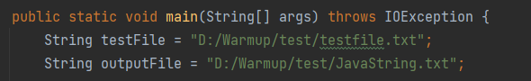
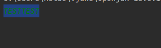
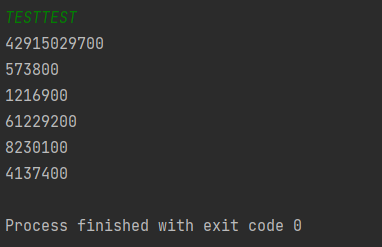
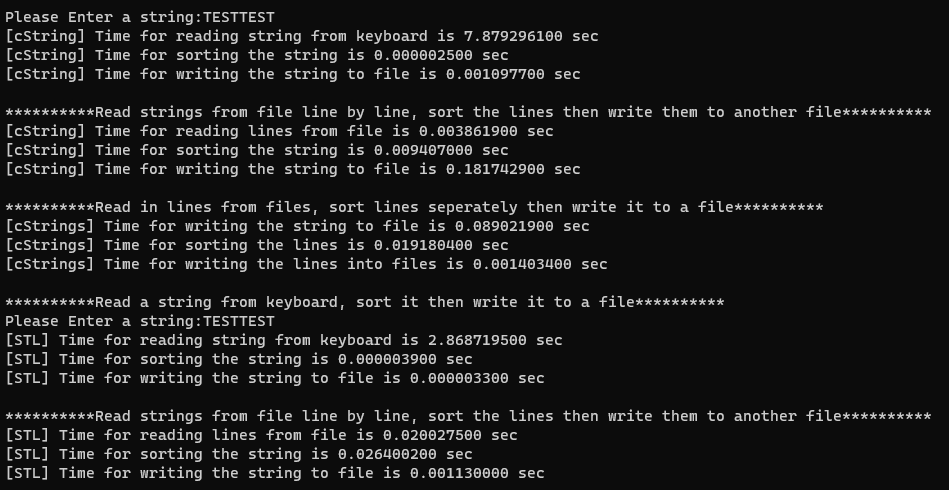

# Report

1. Set the input file (the program reads the file as a string and sorts it)
2. Set the output file (the program writes sorted string to it)
   
3. Run the program
4. Enter the string from console
   

5. Get the result (measured in nanoseconds)
   

Compare with the results of C/C++, the discussion is shown in the table.

| Test items                                           | Java String & Arrays | C char         | C++ STL String & Vector |
| ---------------------------------------------------- | -------------------- | -------------- | ----------------------- |
| Time for sorting the keyboard string "TESTTEST"      | 0.0005738 secs       | 0.0000025 secs | 0.0000039 secs          |
| Time for writing the sorted keyboard string to file  | 0.0012169 secs       | 0.0010977 secs | 0.0000033 secs          |
| Time for reading the string from file                | 0.0612292 secs       | 0.0038619 secs | 0.0200275 secs          |
| Time for sorting the file string                     | 0.0082301 secs       | 0.009407 secs  | 0.0264002 secs          |
| Time for writing the sorted file string back to file | 0.0041374 secs       | 0.1817429 secs | 0.00113 secs            |

Although as a interpreted language, the performance of Java is not bad, and in some cases Java's performance may be higher than C++.
